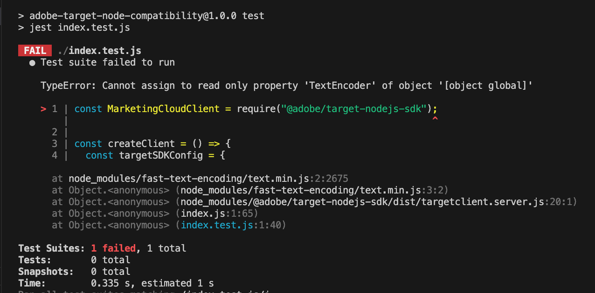

# adobe-target-jest-node-compatibility

Testing node version compatibilities for adobe target sdk with jest

## Bug

With Node v20, requiring the adobe-target-sdk module as part of a `Jest` test throws an error:

```bash
npm i
npm i --save-dev
nvm use 20
npm run test
# TypeError: Cannot assign to read only property 'TextEncoder' of object '[object global]'
```



## For node versions < 20, the tests pass

```
npm i
npm i --save-dev
nvm use 16
npm run test
nvm use 18
npm run test
```

## Possible resolution

It appears that the polyfill done by 'fast-text-encoding' is not compatible with node v20, but only when running tests with jest.
Overriding 'fast-text-encoding' with an empty module seems to resolve the issue. But this has to be done by the SDK consumer.

See example at [package.fixed.json](./package.fixed.json)

```json
// package.json
"overrides": {
    "fast-text-encoding": "0.0.0-empty"
  }
```
